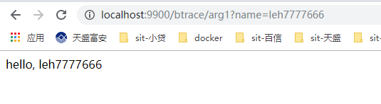
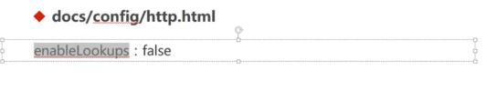

### java生产环境性能监控与调优

[官方文档](https://docs.oracle.com/javase/8/docs/technotes/tools/unix/)

[系统吞吐量（TPS）、用户并发量、性能测试概念和公式](http://www.ha97.com/5095.html)

QPS（TPS）= 并发数/平均响应时间

#### 一. 基于JDK命令行工具的监控（用于生产环境）

常用的 GC 参数:


##### 1.1 JVM参数类型

```txt
[tomcat@server-661fed9e-dae2-423f-87f8-7649d7d4f7da ~]$ jinfo -flags 12040
Attaching to process ID 12040, please wait...
Debugger attached successfully.
Server compiler detected.
JVM version is 25.161-b12
Non-default VM flags: -XX:CICompilerCount=3 -XX:InitialHeapSize=268435456 -XX:MaxHeapSize=268435456 -XX:MaxNewSize=89128960 -XX:MinHeapDeltaBytes=524288 -XX:NewSize=89128960 -XX:OldSize=179306496 -XX:+UseCompressedClassPointers -XX:+UseCompressedOops -XX:+UseParallelGC 
Command line:  -Xms256m -Xmx256m

```

+ 标准参数 （ jvm各个版本相对稳定不变的）

  + -help
  + -server -client
  + -version -showversion
  + -cp -classpath

+ X 参数  不常使用 （jvm各个版本有可能有较小的变化）

  + 非标准化参数

  + -Xint 解释执行  java -Xint -version

  + -Xcomp 第一次使用就编译成本地代码

  + -Xmixed 混合模式，JVM自己来决定是否编译成本地代码

    ```txt
    [tomcat@server-661fed9e-dae2-423f-87f8-7649d7d4f7da ~]$ java -version
    openjdk version "1.8.0_161"
    OpenJDK Runtime Environment (build 1.8.0_161-b14)
    OpenJDK 64-Bit Server VM (build 25.161-b14, mixed mode)
    
    ```

+ XX 参数  经常使用

  + 非标准化参数

  + 相对不稳定

  + 主要用于JVM调优和debug

  + XX 参数 分类

    + Boolean 类型

      格式：-XX:[+-]<name> 表示启用或者禁用name属性

      如：-XX:+UseConcMarkSweepGC

      ​		-XX:+UseG1GC

    + 非Boolean类型 （ key-value类型）

      格式：-XX:<name>=<value>表示name属性的值时value

      如：-XX:MaxGCPauseMills=500

      ​		-XX:GCTimeRatio=19

  + -Xmx -Xms 经常用到
    + 不是X参数，而是XX参数
    + -Xms 等价于 -XX:InitailHeapSize 初始化堆大小
    + -Xmx 等价于 -XX:MaxHeapSize   堆最大大小

  ```txt
  [tomcat@server-661fed9e-dae2 ~]$ jinfo -flag MaxHeapSize 12040
  -XX:MaxHeapSize=268435456
  [tomcat@server-661fed9e-dae2 ~]$ jinfo -flag ThreadStackSize 12040
  -XX:ThreadStackSize=1024 //1024k
  ```

  ​	jinfo -flag ThreadStackSize 12040  ==》 -Xss 查看线程堆栈大小

##### 1.2 运行时JVM参数查看

###### 1.2.1 = & := 的区别

+ -XX:+PrintFlagsInitial  查看初始值
+ -XX:+PrintFlagsFinal   查看最终值

```TXT
[tomcat@server-661fed9e-dae2-423f-87f8-7649d7d4f7da ~]$ java -XX:+PrintFlagsFinal -version
[Global flags]
    uintx AdaptiveSizeDecrementScaleFactor          = 4                                   {product}
    uintx AdaptiveSizeMajorGCDecayTimeScale         = 10                                  {product} 
 bool UsePSAdaptiveSurvivorSizePolicy           = true                                {product}
     bool UseParNewGC                               = false                               {product}
     bool UseParallelGC                            := true                                {product}
     bool UseParallelOldGC                          = true                                {product}
     bool UsePerfData                               = true                                {product}
     bool UsePopCountInstruction                    = true                                {product}
...
需注意的是：这些参数对应的是哪个进程？
对应的是通过执行java -XX:+PrintFlagsFinal -version命令的时候启动的java进程。
如何查看运行时JVM运行参数？jinfo	
```

​		**= 表示默认值**

​	**:= 被用户或者JVM修改后的值 **

​		java -XX:+PrintFlagsFinal -version

​		java -XX:+PrintFlagsFinal -version > flags.txt  重定向到一个文件

​		sz flags.txt 下载文件保存到本地

+ -XX:+UnlockExperimentalVMOptions 解锁实验参数
+ -XX:+UnlockDiagnosticVMOptions 解锁诊断参数
+ -XX:+PrintCommandLineFlags 打印命令行参数

###### 1.2.2 jps 查看java进程

+ jps 类似linux的ps，是专门用来查看java进程
  + jps 
  + jps -l 用来查看哪个类

###### 1.2.3 查看正在运行的JVM参数值

+ jinfo -flag MaxHeapSize [java进程号]pid  打印具体进程的参数

  jinfo -flags [java进程号]pid  打印具体进程中已经被赋值的参数 --Non-default VM flags

+ 查看最大内存

  jinfo -flag MaxHeapSize 12040

+ 查看垃圾回收器

  jinfo -flag UseConcMarkSweepGC 12040

  jinfo -flag UseG1GC 12040

  jinfo -flag UseParallelGC 12040

```txt
[tomcat@server-661fed9e-dae2-423f-87f8-7649d7d4f7da ~]$ jps -l
28514 /odsdb/tomcat/instance/icac/icac-workflow/icac-workflow.jar
12040 /odsdb/tomcat/instance/icac/plmm-biz/plmm-biz.jar
17357 sun.tools.jps.Jps
27726 /odsdb/tomcat/instance/icac/icac-sync/icac-sync.jar
26734 /odsdb/tomcat/instance/icac/icac-gateway/icac-gateway.jar
27637 /odsdb/tomcat/instance/icac/icac-job/icac-job.war
29045 /odsdb/tomcat/instance/icac/icac-upms/icac-upms.jar
823 org.apache.catalina.startup.Bootstrap
6556 org.apache.catalina.startup.Bootstrap
28990 org.apache.catalina.startup.Bootstrap
23999 /odsdb/tomcat/nacos/nacos2/target/nacos-server.jar
[tomcat@server-661fed9e-dae2-423f-87f8-7649d7d4f7da ~]$ jinfo -flag MaxHeapSize 12040
-XX:MaxHeapSize=268435456
[tomcat@server-661fed9e-dae2-423f-87f8-7649d7d4f7da ~]$ jinfo -flags 12040
Attaching to process ID 12040, please wait...
Debugger attached successfully.
Server compiler detected.
JVM version is 25.161-b12
Non-default VM flags: -XX:CICompilerCount=3 -XX:InitialHeapSize=268435456 -XX:MaxHeapSize=268435456 -XX:MaxNewSize=89128960 -XX:MinHeapDeltaBytes=524288 -XX:NewSize=89128960 -XX:OldSize=179306496 -XX:+UseCompressedClassPointers -XX:+UseCompressedOops -XX:+UseParallelGC 
Command line:  -Xms256m -Xmx256m

```

```txt
[tomcat@server-661fed9e-dae2-423f-87f8-7649d7d4f7da ~]$ jinfo -flag UseConcMarkSweepGC 12040
-XX:-UseConcMarkSweepGC
[tomcat@server-661fed9e-dae2-423f-87f8-7649d7d4f7da ~]$ jinfo -flag UseG1GC 12040
-XX:-UseG1GC
[tomcat@server-661fed9e-dae2-423f-87f8-7649d7d4f7da ~]$ jinfo -flag UseParallelGC 12040
-XX:+UseParallelGC

```

##### 1.3 jstat查看JVM统计信息

垃圾回收信息，类加载信息， JIT编译信息

+ 命令格式 

  ```txt
  [tomcat@server-661fed9e-dae2-423f-87f8-7649d7d4f7da ~]$ jstat -help
  Usage: jstat -help|-options
         jstat -<option> [-t] [-h<lines>] <vmid> [<interval> [<count>]]
  ```

  options： -class，-complier，-gc, -printcomplication

###### 1.3.1 类加载

jstat -class  pid  每隔1000ms 共输出10次

jstat -class 12040 1000 10

```txt
[tomcat@server-661fed9e-dae2-423f-87f8-7649d7d4f7da ~]$ jstat -class 12040 1000 10
Loaded  Bytes  Unloaded  Bytes     Time   
 24314 44432.6     2927  4082.0     972.59
 24314 44432.6     2927  4082.0     972.59
 24314 44432.6     2927  4082.0     972.59
 24314 44432.6     2927  4082.0     972.59
 24314 44432.6     2927  4082.0     972.59
 24314 44432.6     2927  4082.0     972.59
 24314 44432.6     2927  4082.0     972.59
 24314 44432.6     2927  4082.0     972.59
 24314 44432.6     2927  4082.0     972.59
 24314 44432.6     2927  4082.0     972.59

```

[-class参数](https://docs.oracle.com/javase/8/docs/technotes/tools/unix/jstat.html#BEHHGFAE)

**-class option**
Class loader statistics.

Loaded: Number of classes loaded.

Bytes: Number of kBs loaded.

Unloaded: Number of classes unloaded.

Bytes: Number of Kbytes unloaded.

Time: Time spent performing class loading and unloading operations.

###### 1.3.2 垃圾收集

+ -gc、-gcutil、-gccause、-gcnew、-gcold

+ JVM的内存结构

  + 堆区

    + YOUNG
      + Survival
        + S0
        + S1
      + Eden
    + OLD

  + 非堆区 即操作系统的一个本地内存，独立于JVM的堆之外

    jdk1.7之前 permSpace

    jdk1.8 metaSpace

    + CCS
    + CodeCache  存放JIT编译的JNI代码和native代码

  

jstat -gc 12040 1000 10


**-gc option** JDK1.8移除永久代，引入元空间MetaSpace


C -》capacity 总大小

U-》used 使用的大小

Garbage-collected heap statistics.

S0C: Current survivor space 0 capacity (kB).

S1C: Current survivor space 1 capacity (kB).

S0U: Survivor space 0 utilization (kB).

S1U: Survivor space 1 utilization (kB).

EC: Current eden space capacity (kB).

EU: Eden space utilization (kB).

OC: Current old space capacity (kB).

OU: Old space utilization (kB).

MC: Metaspace capacity (kB).

MU: Metacspace utilization (kB).

CCSC: Compressed class space capacity (kB).

CCSU: Compressed class space used (kB).

YGC: Number of young generation garbage collection events.

YGCT: Young generation garbage collection time.

FGC: Number of full GC events.

FGCT: Full garbage collection time.

GCT: Total garbage collection time.


###### 1.3.3 JIT编译

+ -compiler
  + jstat -compiler 12040
+ -printcompilation
  + jstat -printcompilation 12040

```txt
[tomcat@server-661fed9e-dae2-423f-87f8-7649d7d4f7da ~]$ jstat -compiler 12040
Compiled Failed Invalid   Time   FailedType FailedMethod
   29404      2       0   207.03          1 com/mysql/jdbc/AbandonedConnectionCleanupThread run
[tomcat@server-661fed9e-dae2-423f-87f8-7649d7d4f7da ~]$ jstat -printcompilation 12040
Compiled  Size  Type Method
   29404    283    1 sun/reflect/GeneratedConstructorAccessor1933 newInstance
```

##### 1.4 JMAP + MAT 实战内存溢出

###### 1.4.1 堆内存溢出 heap

###### 1.4.2 非堆内存溢出 noheap（MetaSpace -》 存储类，方法，field等）

```java
@RestController
public class MemoryController {

    private List<User> userList = new ArrayList<>();

    private List<Class<?>> classList = new ArrayList<>();

    /**
     * 模拟堆内存溢出
     * 只要MemoryController不被回收，List就不会被回收
     * -Xmx32M -Xms32M
     * @return
     */
    @GetMapping("/heap")
    public String heap() {
        int i = 0;
        while (true) {
            userList.add(new User(i++, UUID.randomUUID().toString()));
        }
    }

    /**
     * 模拟非堆内存溢出 - 即MetaSpace溢出
     * 只要MemoryController不被回收，classList不会被回收，那么其存储的Class不会被回收
     * -XX:MetaSpaceSize=32M -XX:MaxMetaSpaceSize=32M
     * @return
     */
    @GetMapping("/noheap")
    public String noheap() {
        while (true) {
            //如何动态生成class文件，常用的是 asm
            classList.addAll(Metaspace.createClasses());
        }
    }
}
```

###### 1.4.3 生产上出现了内存溢出，该如何解决？-》分析内存映像文件

###### 1.4.4 如何导出内存映像文件

+ 内存溢出的原因：

  + 1）内存泄漏（new对象后，一直不释放对象）
  + 2）内存分配不足

+ 如何导出内存映像文件？有两种方式

  + 1）发生内存溢出时自动导出（占用内存比较大的时候可能会导不出来）
    + -XX:+HeapDumpOnOutOfMemoryError
    + -XX:HeapDumpPath=./   设置dump路径

  ```java
  java.lang.OutOfMemoryError: Java heap space
  Dumping heap to ./\java_pid39008.hprof ...
  Heap dump file created [42116436 bytes in 0.225 secs]
  ```

  

  + 2)   使用jmap命令手动导出

    + 发生内存溢出再导出dump文件有点为时已晚，程序运行一段时间后就可以用jmap导出

    + jmap 命令

      option : -heap,  -clstats,  -dump:<dump-options>,  -F

      jmap -heap  查看堆内存区块占用

      

  ```txt
  [tomcat@server-661fed9e-dae2-423f-87f8-7649d7d4f7da ~]$ jmap -help
  Usage:
      jmap [option] <pid>
          (to connect to running process)
      jmap [option] <executable <core>
          (to connect to a core file)
      jmap [option] [server_id@]<remote server IP or hostname>
          (to connect to remote debug server)
  
  where <option> is one of:
      <none>               to print same info as Solaris pmap
      -heap                to print java heap summary
      -histo[:live]        to print histogram of java object heap; if the "live"
                           suboption is specified, only count live objects
      -clstats             to print class loader statistics
      -finalizerinfo       to print information on objects awaiting finalization
      -dump:<dump-options> to dump java heap in hprof binary format
                           dump-options:
                             live         dump only live objects; if not specified,
                                          all objects in the heap are dumped.
                             //导出格式            
                             format=b     binary format
                             //导到哪个文件
                             file=<file>  dump heap to <file>
                             
                           Example: jmap -dump:live,format=b,file=heap.bin <pid>
      -F                   force. Use with -dump:<dump-options> <pid> or -histo
                           to force a heap dump or histogram when <pid> does not
                           respond. The "live" suboption is not supported
                           in this mode.
      -h | -help           to print this help message
      -J<flag>             to pass <flag> directly to the runtime system
  
  ```

  ```java
  C:\Users\Administrator>cd Desktop
  
  C:\Users\Administrator\Desktop>jmap -dump:format=b,file=heap.hprof 40360
  Dumping heap to C:\Users\Administrator\Desktop\heap.hprof ...
  Heap dump file created
  ```

  

###### 1.4.5 MAT分析内存溢出

[MAT下载](http://www.eclipse.org/mat/downloads.php)

file ->open heap dump ->

```txt
One instance of "com.leh.monitor_tuning.chapter2_jvm.MemoryController" loaded by "sun.misc.Launcher$AppClassLoader @ 0xfe22cde8" occupies 20,098,824 (76.40%) bytes. The memory is accumulated in one instance of "java.lang.Object[]" loaded by "<system class loader>".
```


常用的功能：

1）查看对象的数量   

class com.leh.monitor_tuning.chapter2_jvm.User @ 0xfe7c72e0 

--》Merge shortest paths to GC Roots 

--》排除虚引用只看强引用 --》可以很清楚的看到从GCRoot到对象

​						

					  

 2）查看对象占用的字节数

Merge shortest paths to GC Roots --》排除虚引用只看强引用


##### 1.5 JSTACK 实战死循环和死锁

若观察到cpu利用率飙高，如何定位问题？很有可能发生死循环。jstack用来打印jvm内部所有的线程信息。

###### 1.5.1 jstack与线程状态

+ jstack 命令格式

  ```txt
  [tomcat@server-661fed9e-dae2-423f-87f8-7649d7d4f7da ~]$ jstack -help
  Usage:
      jstack [-l] <pid>
          (to connect to running process)
      jstack -F [-m] [-l] <pid>
          (to connect to a hung process)
      jstack [-m] [-l] <executable> <core>
          (to connect to a core file)
      jstack [-m] [-l] [server_id@]<remote server IP or hostname>
          (to connect to a remote debug server)
  
  Options:
      -F  to force a thread dump. Use when jstack <pid> does not respond (process is hung)
      -m  to print both java and native frames (mixed mode)
      -l  long listing. Prints additional information about locks
      -h or -help to print this help message
  
  ```

+ top -p pid -H 

  ```txt
  Java 应用诊断包括线程、堆栈、GC 等方面的诊断;
  jstack 命令通常配合 top 使用，
  -》通过 top -H -p pid 定位 Java 进程和线程，
  -》再利用 jstack -l pid > pid.txt 导出线程栈
  -》 下载文件 sz pid.txt
  -》由于线程栈是瞬态的，因此需要多次 dump，一般 3 次 dump，一般每次隔 5s 就行。
  -》将 top 定位的 Java 线程 pid 转成 16 进制，得到 Java 线程栈中的 nid，
  -》在pid.txt中可以找到对应的问题线程栈。
  ```

+ jstack pid

+ printf  "%x"  十进制的线程id --》得到16进制的线程id

​	jstack pid 

​	jstack 12040 > 12040.txt

​	sz 12040.txt


[java线程状态](https://docs.oracle.com/javase/8/docs/technotes/guides/troubleshoot/tooldescr034.html#sthref31)


###### 1.5.2  实战死循环导致cpu飙高

**OS 诊断**

​		OS 的诊断主要关注的是 CPU、Memory、I/O 三个方面。

[**CPU 诊断**](https://mp.weixin.qq.com/s/MRA_B8xLgT3rA_5eapfuIg)

主要关注平均负载（Load Average），CPU 使用率，上下文切换次数（Context Switch）。

通过 top 命令可以查看系统平均负载和 CPU 使用率；


平均负载有三个数字：63.66，58.39，57.18，分别表示过去 1 分钟、5 分钟、15 分钟机器的负载。按照经验，若数值小于 0.7*CPU 个数，则系统工作正常；若超过这个值，甚至达到 CPU 核数的四五倍，则系统的负载就明显偏高。


通过 `vmstat` 命令可以查看 CPU 的上下文切换次数


[**Memory**](https://mp.weixin.qq.com/s/MRA_B8xLgT3rA_5eapfuIg)

从操作系统角度，内存关注应用进程是否足够，可以使用 free –m 命令查看内存的使用情况。通过 top 命令可以查看进程使用的虚拟内存 VIRT 和物理内存 RES，根据公式 VIRT = SWAP + RES 可以推算出具体应用使用的交换分区（Swap）情况，使用交换分区过大会影响 Java 应用性能，可以将 swappiness 值调到尽可能小。因为对于 Java 应用来说，占用太多交换分区可能会影响性能，毕竟磁盘性能比内存慢太多。

[**I/O**](https://mp.weixin.qq.com/s/MRA_B8xLgT3rA_5eapfuIg)

I/O 包括磁盘 I/O 和网络 I/O，一般情况下磁盘更容易出现 I/O 瓶颈。

通过 iostat 可以查看磁盘的读写情况，通过 CPU 的 I/O wait 可以看出磁盘 I/O 是否正常。如果磁盘 I/O 一直处于很高的状态，说明磁盘太慢或故障，成为了性能瓶颈，需要进行应用优化或者磁盘更换。

除了常用的 top、 ps、vmstat、iostat 等命令，还有其他 Linux 工具可以诊断系统问题，如 mpstat、tcpdump、netstat、pidstat、sar 等。Brendan 总结列出了 Linux 不同设备类型的性能诊断工具，如图 4 所示，可供参考。


对于 Java 应用，通过`top+jstack+jmap+MAT` 可以定位大多数应用和内存问题，可谓必备工具。

#### 二. 基于JvisualVm的可视化监控

+ 监控本地tomcat
+ 监控远程tomcat
+ 监控远程普通java进程

##### 2.1 监控本地tomcat

[安装插件](https://visualvm.github.io/pluginscenters.html) 

visualVM-GC


Btrace-workbench


设置插件中心地址为对应jdk版本的地址


##### 2.2 监控远程tomcat

+ 添加远程主机ip

****


+ 修改部署在远程tomcat的shell脚本 Catalina.sh --》 JMX技术
  + JAVA_OPTS部分添加如下内容
  + 设置jmx远程端口9004  hostname为部署的主机ip


##### 2.3 监控远程普通java进程


[JvisualVm中文文档](https://visualvm.github.io/documentation.html)

#### 三. 基于Btrace的监控调试

##### 3.1 Btrace的介绍

+ Btrace可以动态的向目标应用程序的字节码注入追踪代码

  应用程序不重启的情况下，动态修改字节码，达到监控调试目的。

+ 使用的技术包括JavaComplierApi、JVMTI、Agent、Instrumentation + ASM

##### 3.2 Btrace安装 - [github地址](https://github.com/btraceio/btrace)

+ 新建环境变量 BTRACR_HOME

+ 添加Path：%BTRACR_HOME%\bin

  

  

##### 3.3 两种运行脚本方式

```java
/**
 * btrace脚本本身跟实际应用java代码没有关系，
 * 可以单独建一个脚本项目，此处为了演示方便故放一起
 *
 * 模拟线上运行程序，实时动态获取参数值
 * @BTrace-表示是btrace脚本
 */
@BTrace
public class PrintArgSimple {


   /**
    * onMethod注解表示 拦截哪个类的哪个方法，在什么时候拦截
    * @param pcn  类名
    * @param pmn  方法名
    * @param args 参数
    */
   @OnMethod(
           clazz="com.leh.monitor_tuning.chapter3_btrace.BtraceController",
           method="arg1",
           location=@Location(Kind.ENTRY)
   )
   public static void anyRead(@ProbeClassName String pcn, @ProbeMethodName String pmn, AnyType[] args) {
      BTraceUtils.printArray(args);
      BTraceUtils.println(pcn+","+pmn);
      BTraceUtils.println();
    }
}
```

###### 3.3.1 在JvisualVM中添加Btrace插件btrace-workbench,添加classpath


###### 3.3.2 使用命令行 btrace <pid> <trace_script>

[Running](https://github.com/btraceio/btrace#running)

- `<btrace>/bin/btrace <PID> <trace_script>` will attach to the **java** application with the given **PID** and compile and submit the trace script
- `<btrace>/bin/btracec <trace_script>` will compile the provided trace script
- `<btrace>/bin/btracer <compiled_script> <args to launch a java app>` will start the specified java application with the btrace agent running and the script previously compiled by *btracec* loaded

```txt
C:\Users\Administrator>jps -l
43220
123668 org.jetbrains.idea.maven.server.RemoteMavenServer
32712
124888 com.leh.monitor_tuning.MonitorTuningApplication
132664 org.jetbrains.jps.cmdline.Launcher
134184 sun.tools.jps.Jps
43084 org/netbeans/Main

C:\Users\Administrator>cd D:\ideawork\monitor_tuning\src\main\java\com\leh\monitor_tuning\chapter3_btrace\btracescripts

C:\Users\Administrator>d:

D:\ideawork\monitor_tuning\src\main\java\com\leh\monitor_tuning\chapter3_btrace\btracescripts>dir
 驱动器 D 中的卷是 OS
 卷的序列号是 0695-4966

 D:\ideawork\monitor_tuning\src\main\java\com\leh\monitor_tuning\chapter3_btrace\btracescripts 的目录

2019/11/22  14:11    <DIR>          .
2019/11/22  14:11    <DIR>          ..
2019/11/22  14:11               633 PrintArgSimple.java
               1 个文件            633 字节
               2 个目录 731,010,289,664 可用字节

D:\ideawork\monitor_tuning\src\main\java\com\leh\monitor_tuning\chapter3_btrace\btracescripts>btrace 124888 PrintArgSimple.java
[leh7777666, ]
com.leh.monitor_tuning.chapter3_btrace.BtraceController,arg1
```



##### 3.4 Btrace使用详解

###### 3.4.1 拦截方法 构造函数 、同名函数

```java
@RestController
@RequestMapping("/btrace")
public class BtraceController {

    @RequestMapping("/arg1")
    public String arg1(@RequestParam("name") String name){
        return "hello, " + name;
    }

    @RequestMapping("/arg2")
    public User arg2(User user) {
        return user;
    }

    @RequestMapping("/constructor")
    public User constructor(User user) {
        return user;
    }

    @RequestMapping("/same1")
    public String same(@RequestParam("name")String name) {
        return "hello,"+name;
    }

    @RequestMapping("/same2")
    public String same(@RequestParam("name")String name,@RequestParam("id")int id) {
        return "hello,"+name+","+id;
    }
    
     @RequestMapping("/exception")
    public String exception() {
        try {
            System.out.println("start...");
            System.out.println(1/0);
            System.out.println("end...");
        }catch(Exception e) {
            //
        }
        return "success";
    }

}
```

+ 普通方法 @OnMethod(clazz="", method="")

  ```java
  @BTrace
  public class PrintArgSimple {
  
  
      @OnMethod(
              clazz = "com.leh.monitor_tuning.chapter3_btrace.BtraceController",
              method = "arg1",
              location = @Location(Kind.ENTRY)
      )
      public static void anyRead(@ProbeClassName String pcn, @ProbeMethodName String pmn, AnyType[] args) {
          BTraceUtils.printArray(args);
          BTraceUtils.println(pcn + "," + pmn);
          BTraceUtils.println();
      }
  }
  ```

+ 构造函数 @OnMethod(clazz="", method="<init>")   构造函数在字节码层面就是init

  ```java
  /**
   * 模拟拦截构造函数
   */
  @BTrace
  public class PrintConstructor {
     
     @OnMethod(
             clazz="com.leh.monitor_tuning.chapter2_jvm.User",
             method="<init>"
     )
     public static void anyRead(@ProbeClassName String pcn, @ProbeMethodName String pmn, AnyType[] args) {
        BTraceUtils.println(pcn+","+pmn);
        BTraceUtils.printArray(args);
        BTraceUtils.println();
      }
  }
  ```

+ 同名函数，用参数区分 

  ```java
  @BTrace
  public class PrintSame {
     
     @OnMethod(
             clazz="com.leh.monitor_tuning.chapter3_btrace.BtraceController",
             method="same"
     )
     public static void anyRead(@ProbeClassName String pcn, @ProbeMethodName String pmn, String name) {
        BTraceUtils.println(pcn+","+pmn + "," + name);
        BTraceUtils.println();
      }
  }
  ```

###### 3.4.2 拦截时机

+ Kind.ENTRY : 入口，默认值

+ Kind.RETURN : 返回

  ```java
  
  /**
   * 拦截返回值
   */
  @BTrace
  public class PrintReturn {
     
     @OnMethod(
             clazz="com.leh.monitor_tuning.chapter3_btrace.BtraceController",
             method="arg1",
             location=@Location(Kind.RETURN)
     )
     public static void anyRead(@ProbeClassName String pcn, @ProbeMethodName String pmn, @Return AnyType result) {
        BTraceUtils.println(pcn+","+pmn + "," + result);
        BTraceUtils.println();
      }
  }
  ```

+ Kind.THROW : 异常 （发生异常，而日志中没有异常信息，不用停服务不加log，如何处理）

  ```java
  /**
   * 拦截异常（即使被捕获且未打印日志的情况下，btrace也可以拦截到异常，并清晰的输出）
   */
  @BTrace 
  public class PrintOnThrow {    
      // store current exception in a thread local
      // variable (@TLS annotation). Note that we can't
      // store it in a global variable!
      @TLS 
      static Throwable currentException;
  
      // introduce probe into every constructor of java.lang.Throwable
      // class and store "this" in the thread local variable.
      @OnMethod(
          clazz="java.lang.Throwable",
          method="<init>"
      )
      public static void onthrow(@Self Throwable self) {//new Throwable()
          currentException = self;
      }
  
      @OnMethod(
          clazz="java.lang.Throwable",
          method="<init>"
      )
      public static void onthrow1(@Self Throwable self, String s) {//new Throwable(String msg)
          currentException = self;
      }
  
      @OnMethod(
          clazz="java.lang.Throwable",
          method="<init>"
      )
      public static void onthrow1(@Self Throwable self, String s, Throwable cause) {//new Throwable(String msg, Throwable cause)
          currentException = self;
      }
  
      @OnMethod(
          clazz="java.lang.Throwable",
          method="<init>"
      )
      public static void onthrow2(@Self Throwable self, Throwable cause) {//new Throwable(Throwable cause)
          currentException = self;
      }
  
      // when any constructor of java.lang.Throwable returns
      // print the currentException's stack trace.
      @OnMethod(
          clazz="java.lang.Throwable",
          method="<init>",
          location=@Location(Kind.RETURN)
      )
      public static void onthrowreturn() {
          if (currentException != null) {
             BTraceUtils.Threads.jstack(currentException);
             BTraceUtils.println("=====================");
              currentException = null;
          }
      }
  }
  ```

+ Kind.Line : 行  可以知道某一行代码在某一次请求中是否执行了

  ```java
  
  /**
   * 追踪某一行
   */
  @BTrace
  public class PrintLine {
     
     @OnMethod(
             clazz="com.leh.monitor_tuning.chapter3_btrace.BtraceController",
             method="exception",
             location=@Location(value=Kind.LINE, line=-1)
     )
     public static void anyRead(@ProbeClassName String pcn, @ProbeMethodName String pmn, int line) {
        BTraceUtils.println(pcn+","+pmn + "," +line);
        BTraceUtils.println();
      }
  }
  ```

  

###### 3.4.3 拦截this、参数、返回值、复杂对象

+ this ： @Self

+ 入参：可以用AnyType , 也可以用真实类型，同名的用真实的

+ 返回：@Return

+ 获取对象的值

  + 简单类型 ： 直接获取
  + 复杂类型 ：反射，类名 + 属性

  ```java
  @BTrace
  public class PrintArgComplex {
     
     
     @OnMethod(
             clazz="com.leh.monitor_tuning.chapter3_btrace.BtraceController",
             method="arg2",
             location=@Location(Kind.ENTRY)
     )
     public static void anyRead(@ProbeClassName String pcn, @ProbeMethodName String pmn, User user) {
        //print all fields
        BTraceUtils.printFields(user);
        //print one field
        Field filed2 = BTraceUtils.field("com.leh.monitor_tuning.chapter2_jvm.User", "name");
        BTraceUtils.println(BTraceUtils.get(filed2, user));
        BTraceUtils.println(pcn+","+pmn);
        BTraceUtils.println();
      }
  }
  ```

  需要指定编译后的class文件路径，否则会找不到类

  ```java
  btrace -cp "D:\ideawork\monitor_tuning\target\classes" 139832 PrintArgComplex.java
  ```

```txt
D:\ideawork\monitor_tuning\src\main\java\com\leh\monitor_tuning\chapter3_btrace\btracescripts>jps -l
43220
123668 org.jetbrains.idea.maven.server.RemoteMavenServer
32712
136408 sun.tools.jps.Jps
139832 com.leh.monitor_tuning.MonitorTuningApplication
141212 org.jetbrains.jps.cmdline.Launcher

D:\ideawork\monitor_tuning\src\main\java\com\leh\monitor_tuning\chapter3_btrace\btracescripts>btrace 139832 PrintArgComplex.java
PrintArgComplex.java:3: 错误: 程序包com.leh.monitor_tuning.chapter2_jvm不存在
import com.leh.monitor_tuning.chapter2_jvm.User;
                                          ^
PrintArgComplex.java:18: 错误: 找不到符号
        public static void anyRead(@ProbeClassName String pcn, @ProbeMethodName String pmn, User user) {
                                                                                            ^
  符号:   类 User
  位置: 类 com.leh.monitor_tuning.chapter3_btrace.btracescripts.PrintArgComplex
BTrace compilation failed


D:\ideawork\monitor_tuning\src\main\java\com\leh\monitor_tuning\chapter3_btrace\btracescripts>btrace -cp "D:\ideawork\monitor_tuning\target\classes" 139832 PrintArgComplex.java
{id=1, name=leh, }
leh
com.leh.monitor_tuning.chapter3_btrace.BtraceController,arg2
```


###### 3.4.4 拦截正则表达式方法

```java
@BTrace
public class PrintRegex {
   
   @OnMethod(
           clazz="com.leh.monitor_tuning.chapter3_btrace.BtraceController",
           method="/.*/"
   )
   public static void anyRead(@ProbeClassName String pcn, @ProbeMethodName String pmn) {
      BTraceUtils.println(pcn+","+pmn);
      BTraceUtils.println();
    }
}
```

###### 3.4.5 追踪jinfo信息

```java
@BTrace
public class PrintJinfo {
    static {
       BTraceUtils.println("System Properties:");
       BTraceUtils.printProperties();
       BTraceUtils.println("VM Flags:");
       BTraceUtils.printVmArguments();
       BTraceUtils.println("OS Enviroment:");
       BTraceUtils.printEnv();
       BTraceUtils.exit(0);
    }
}
```

###### 3.4.6 其他

+ 打印行号 ：Kind.LINE
+ 打印堆栈 : Threads.jstack()
+ 打印环境变量

##### 3.5 注意事项

+ 默认只能本地运行 只能调试本地的java进程，若想要在本地调试远程的java进程，需要修改源代码
+ 生产环境下可以使用，但是被修改的字节码不会被还原，脚本尽量不要有太消耗、占用系统资源的操作。

#### 四. Tomcat 性能监控与调优

##### 4.1 主要内容

+ tomcat远程debug
+ tomcat-manager 监控  - tomcat自带的监控工具，tomcat5以后默认关闭
+ psi-probe 监控 更加强大
+ tomcat调优

##### 4.2 tomcat远程debug

##### 4.2.1 JDWP介绍

#####  		[JDWP文档](https://www.ibm.com/developerworks/cn/java/j-lo-jpda3/)

```xml
JDWP 是 Java Debug Wire Protocol 的缩写，它定义了调试器（debugger）和被调试的 Java 虚拟机（target vm）之间的通信协议。
```

1) 登录远程主机，进入到tomcat目录  ./bin/startup.sh

2)  vim  ./bin/startup.sh  在`start`前增加参数 `jpda `

exec  "$PRGDIR"/"$EXECUTABLE"  jpda start "$@"

3) vim ./bin/catalina.sh

搜索  `JPDA_OPTS`


默认在localhost:8000 端口进行监听

修改 JPDA_ADDRESS="54321"

4) 启动tomcat

查看启动日志 tail -f ./logs/catalina.out

查看 54321 端口 是否被监听

nestat -nap |grep 54321


5) demo部署远程tomcat，使用本地的eclipse或idea进行远程调试

若要打war包，需要修改：

+ 修改打包方式 jar --》 war

  + 修改MonitorTuningApplication 启动类，extends `SpringBootServletInitializer`

  + 重写com.imooc.monitor_tuning.MonitorTuningApplication#configure方法  固定写法

  + maven clean package

  + 上传到远程tomcat webapp目录下 

    +  `rz `上传
    +  `sz`下载

  + 本地idea 新建远程连接 ，指定

    + host  tomcat所在主机
    + port  54321

  + 查看程序运行时起作用的参数

    ps -ef |grep demo

    

  ```java
  @SpringBootApplication
  public class MonitorTuningApplication extends SpringBootServletInitializer{ 
  
     public static void main(String[] args) {
        SpringApplication.run(MonitorTuningApplication.class, args);
     }
     
     @Override
      protected SpringApplicationBuilder configure(SpringApplicationBuilder builder) {
          return builder.sources(MonitorTuningApplication.class);
      }
  }
  ```

```java
@RestController
@RequestMapping("/ch5")
public class DemoController {
   @RequestMapping("/hello")
   public String hello() {
      String str = "";
      for(int i=0;i<10;i++) {
         str += i;
      }
      return str;
   }
}
```

##### 4.3 tomcat - manager 监控

+ 文档 ： docs/manager-howto.html

+ 开启步骤：

  + conf/tomcat-user.xml 添加用户

  + conf/Catalina/localhost/manager.xml配置允许的远程连接的ip地址

    默认没有manager.xml 文件，需要新建出来

  + 重启

 


登录访问：127.0.0.1:8080/manager/ -->输入用户名，密码


**Server status**

内存信息


**线程信息**


##### 4.4 psi-probe 监控

github [地址](https://github.com/psi-probe/psi-probe)

+ git clone git@github.com:psi-probe/psi-probe.git
+ maven clean package -Dmaven.test.skip
+ web/target/probe.war部署到tomcat下
  + 同样需要修改配置文件 配置用户
  + 增加manager.xml文件配置可以访问的ip


###### 4.4.1 Application

+ 应用的统计信息
+ 请求，session， jsp预编译

##### 4.5 tomcat优化

+ 内存优化 - jvm部分
+ 线程优化
+ 配置优化

###### 4.5.1 线程优化

+ docs/config/http.html 文档 - 主要是以下几个参数


###### 4.5.2 配置优化

+ docs/config/host.html 文档 

  

+ docs/config/http.html 文档 

  ​	

